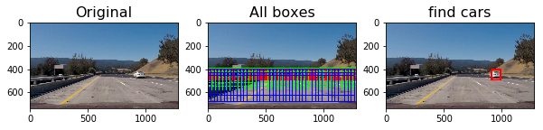
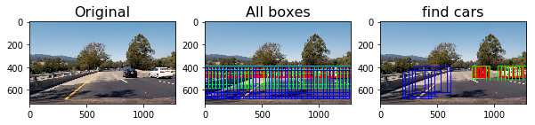
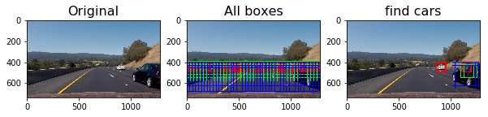
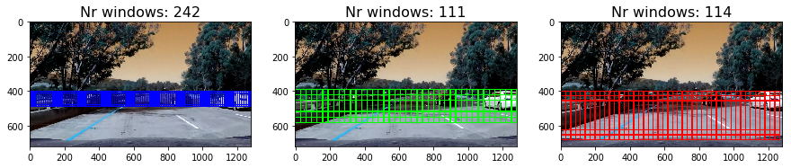
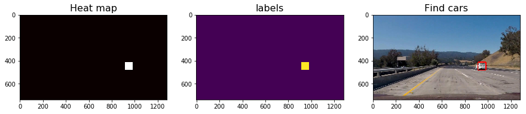
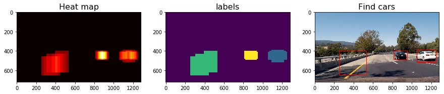
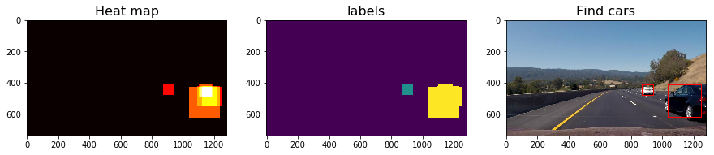

# Vehicle Detection and Tracking

<a href="http://www.youtube.com/watch?feature=player_embedded&v=u9XTdT2nVkw" target="_blank">

The Project
---

The goal of this project is to develop a pipeline to process a video stream from a forward-facing camera mounted on the front of a car, and output an annotated video which identifies the position of the vehicles in the road.

The steps of this project are the following:

1. Define the features to extract.
2. Load the training data and extract the features defined.
3. Normalize the features extract.
4. Build, fit and validate a SVM classifier
4. Define the algorithm to extract the features from each stream in the video.
5. Test an validate the algorithm in test images.
6. Create a video processing pipeline.
7. Create an enhance pipeline that correlate the information of a sequence of stream.


## 1. Feature extraction

### 1.1 Color transformation

As is seen in other projects, the color space RGB are not the most inidicated one to work in situations of high contrast of light. Therefore first to extract any feature from an image, a color transformation will be applied. The **color space** is the first parameter of the pipeline. 

```python
def convert_color(img, color_space='BGR'):
```

### 1.2 Spatial binning

The first features to be extracted from the image are the raw values of the image pixels for all the channels. In order to reduce the feature number and extract all the relevant information a spatial bin is applied to the image. An image with a resolution of 32x32 pixel resolution is still identificable by eye and we will not loss the esence of the image. The **spatial size** is a parameter of the pipeline.

```python
def bin_spatial(img, size=(32, 32)):                
```

### 1.3 Color histogram
We Will extract the color histogram of the image to be used as features. The **number of bins** in the histogram is a parameter of the pipeline.

```python
def color_hist(img, nbins=32):    
```

### 1.4 HOG features

The last feature to be extract is the HOG: Histogram of oriented gradients. Is beyond the porpouse of this report explained how HOG works. Lets said that this features will give us information about the shapes of the object in the image. The HOG features could leads to false positive as the shapes in the HOG space could be "easly" confused.

The extraction of the HOG as features depends on the followoing parameters that will be parameters as well of the pipeline: **orient, pixel per cell and cells per block**

```python
def get_hog_features(img, orient, pix_per_cell, cell_per_block, 
                        vis=False, feature_vec=True):
```

### 1.5 Extract feature from one image

Extract all the features defined from a single image (stream).

```python

colorspace = 'YCrCb' # Can be RGB, HSV, LUV, HLS, YUV, YCrCb
orient = 9
pix_per_cell = 8
cell_per_block = 2
hog_channel = 'ALL' # Can be 0, 1, 2, or "ALL"
spatial_size=(32, 32)
hist_bins = 32

def img_features(feature_image, spatial_feat, hist_feat, hog_feat, hist_bins, orient, 
                        pix_per_cell, cell_per_block, hog_channel, spatial_size):
```

## 2.0 Classifier 

### 2.1 Data load

Data exploration:

```python
Number of vehicle images:  8968
Number of non-vehicle images:  8792

    Shape (64, 64, 3)
    max 255
    min 7
    mean 100.578369141
```

### 2.2 Features extraction

```python
#Extract the features
car_features = extract_features(cars, cspace=colorspace, 
                        spatial_size = spatial_size, hist_bins = hist_bins, orient=orient, 
                        pix_per_cell=pix_per_cell, cell_per_block=cell_per_block, 
                        hog_channel=hog_channel, 
                        spatial_feat=spatial_feat, hist_feat=hist_feat, hog_feat=hog_feat)

```
    502.51 Seconds to extraction...


### 2.3 Feature normalization

Once the features has been extracted are normalizes and the scaler is saved to be used in the pipeline.

```python
# Fit a per-column scaler
X_scaler = StandardScaler().fit(X)
# Apply the scaler to X
scaled_X = X_scaler.transform(X)
```
### 2.4 Train the clasifier

Once the normalizes the features are split to create the train and test features. With the paramters choosen we obtain an accuracy of arounf 0.994.

```python
X_train, X_test, y_train, y_test = train_test_split(scaled_X, y, 
                                                    test_size=0.2, 
                                                    random_state=rand_state)
# Use a linear SVC 
svc = LinearSVC()
svc.fit(X_train, y_train)
```
## 3. Window search

### 3.1 Load test images and classifier


```python
images = glob.glob('test_images/straight_lines*.jpg')
images = images +  glob.glob('test_images/test*.jpg')

imgs = []

for idx, fname in enumerate(images):
    
    img = cv2.imread(fname)
    imgs.append(img)
```


```python
#Data exploration
print("Shape", img.shape)
print("max", np.amax(img))
print("min", np.amin(img))
print("mean", np.mean(img))
```

    Shape (738, 1280, 3)
    max 255
    min 0
    mean 107.832606072


### 3.2 Find cars in image

For every image of the stream, we defined a sliding window algorithm to extract the images to pass through our classifier.
This function return the boxes (bboxs) where a car has been identified plus other values that are used for debugging the algorithm.  The function received paramters that allow us to tune the searching as the start/stop position, the sliding delta (cell_per_step) and the scale of the image. 

```python
# Define a single function that can extract features using hog sub-sampling and make predictions
def find_cars(img, ystart, ystop, scale, svc, 
              X_scaler, orient, pix_per_cell, cell_per_block, 
              spatial_size, hist_bins, color_space, hog_channel, 
              cells_per_step = 2,
              spatial_feat=True, hist_feat=True, hog_feat=True):
    
                
    return bboxs, subimgs, feat, all_bboxs
```

### 3.3 Test

The search algorithm is performed 3 times modifying the parameters to try to the most accurate way the cars and reduce the number of searching windows.

```python    
    scale = 1.25
    ystart = 400
    ystop = 490
    cells_per_step = 1.0
    bboxs1, subimgs1, feat1, all_bboxs1 = find_cars(img, ystart, ystop, 
                    scale, svc, X_scaler, 
                    orient, pix_per_cell, 
                    cell_per_block, 
                    spatial_size, hist_bins, colorspace, hog_channel,
                    cells_per_step)
    
    scale = 2.0
    ystart = 390
    ystop = 590
    cells_per_step = 2.0
    bboxs2, subimgs2, feat2, all_bboxs2 = find_cars(img, ystart, ystop, 
                    scale, svc, X_scaler, 
                    orient, pix_per_cell, 
                    cell_per_block, 
                    spatial_size, hist_bins, colorspace, hog_channel,
                    cells_per_step)
    
    scale = 3.5
    ystart = 400
    ystop = 690
    cells_per_step = 1.0
    bboxs3, subimgs3, feat3, all_bboxs3 = find_cars(img, ystart, ystop, 
                    scale, svc, X_scaler, 
                    orient, pix_per_cell, 
                    cell_per_block, 
                    spatial_size, hist_bins, colorspace, hog_channel,
                    cells_per_step)
```
The objective is to identify the cars in 3 different areas, using smaller windows for those cars that area away and big windows for those that are close. The tune of these parameters is the most important factor for the pipeline performance.
The small windows will increase rapidly the number of searching windows, while big windows will give us more false positive.






Reducing the number of windows will speed up the stream processing. If this algorithm is implemented in a real time application will be a important point to look at.



## 4. Multiple Detections & False Positives

### 4.1 Add heat and Draw boxes on labeled areas


```python
def add_heat(img, bbox_list):
    return heatmap
```

```python
def apply_threshold(heatmap, threshold):
    return heatmap
```

```python
def draw_labeled_bboxes(img, labels):
```

### 4.3 Test







## 5. Pipeline

Definition of the first pipeline to process the viedo stream.

Group all parameters for the search algorithm.

```python
#Define all the scales to search for cars
scales = [1.25, 2.0, 3.5]
ystarts = [400, 390, 400]
ystops = [490, 590, 690]
cellsPerStepS = [1.0, 2.0, 1.0]
```
Define the pipeline with the functions described above.

```python
def pipeline(img):
    
    bboxs = []
    
    #Find cars in the image with different scales
    for scale, ystart, ystop, cellsPerStep in zip(scales,ystarts,ystops,cellsPerStepS):
        
        #Find for cars
        bbox, subimg, feat, allbox = find_cars(img, ystart, ystop, 
                                        scale, svc, X_scaler, 
                                        orient, pix_per_cell, 
                                        cell_per_block, 
                                        spatial_size, hist_bins, 
                                        colorspace, hog_channel, cellsPerStep)
        #append the current boxes
        bboxs = bboxs + bbox
    
    # Add heat to each box in box list
    heat = add_heat(img,bboxs)
    
    # Apply threshold to help remove false positives
    heat = apply_threshold(heat,2)
    
    print(heat.shape)
        
    # Find final boxes from heatmap using label function
    labels = label(heatmap)
    draw_img = draw_labeled_bboxes(np.copy(img), labels)
        
    return draw_img
```

Test the pie


### 6. Video Processing 

```python
clip_output = 'output_images/VehicleDetection.mp4'
clip = VideoFileClip("project_video.mp4")
clip = clip.fl_image(pipeline)
%time clip.write_videofile(clip_output, audio=False)
```


### 6.1 Video Processing Plus

Define the enhanced pipeline that correlates the information in sequence of frames.

The class **VehDetection** save the heatmap of the last n frames and apply a threshold (th) to evaluate if its a false positive or not. If in a frame a car is not found, it will use the information of the last n frames to keep the box.

```python
from queue import *

class VehDetection:
    
    IMG_SHAPE = (720, 1280)
    
    def __init__(self, n, th):
        self.Heat = []
        self.n = n
        self.threshold = th
    
    def putHeatmap(self, heatmap):
        
        heatmap[heatmap > 0] = 1
        
        if(len(self.Heat) > self.n):
            self.Heat.pop(0)
            
        self.Heat.append(heatmap)
    
    def getHeatmap(self):
        
        heatmap = np.zeros(self.IMG_SHAPE).astype(np.float)
        
        for heat in self.Heat:
            heatmap = heatmap + heat
        
        heatmap = apply_threshold(heatmap,self.threshold)
                
        return heatmap        
```


```python
vehDetection = VehDetection(n=10, th=2)

def pipelinePlus(img):
    
    bboxs = []
    
    #Find cars in the image with different scales
    for scale, ystart, ystop, cellsPerStep in zip(scales,ystarts,ystops, cellsPerStepS):
        
        #Find for cars
        bbox, subimg, feat, allbox = find_cars(img, ystart, ystop, 
                                        scale, svc, X_scaler, 
                                        orient, pix_per_cell, 
                                        cell_per_block, 
                                        spatial_size, hist_bins, 
                                        colorspace, hog_channel,
                                        cellsPerStep)
        #append the current boxes
        bboxs = bboxs + bbox
       
    # Add heat to each box in box list
    heat = add_heat(img,bboxs)
    
    # Apply threshold to help remove false positives
    heat = apply_threshold(heat,2)
    
    #Add and get the heat
    vehDetection.putHeatmap(heat)
    heatmap = vehDetection.getHeatmap()
       
    # Find final boxes from heatmap using label function
    labels = label(heatmap)
    draw_img = draw_labeled_bboxes(np.copy(img), labels)
        
    return draw_img
```

## 7. Discussion

There is still room for improvement:
1. Test with a combination of color space to try to remove the false positives due the change of the light and shadows in the road.
2. Tune better the areas of interest to extract the figure. It is possible that add a 4th area of interest will be the best option.
3. Add weights for each area of interest. The weight will be applied to the box first to compute the heat. The biggest areas will have a bigger weight.
4. Try to reduce the number of searching windows to speed up the processing. 
